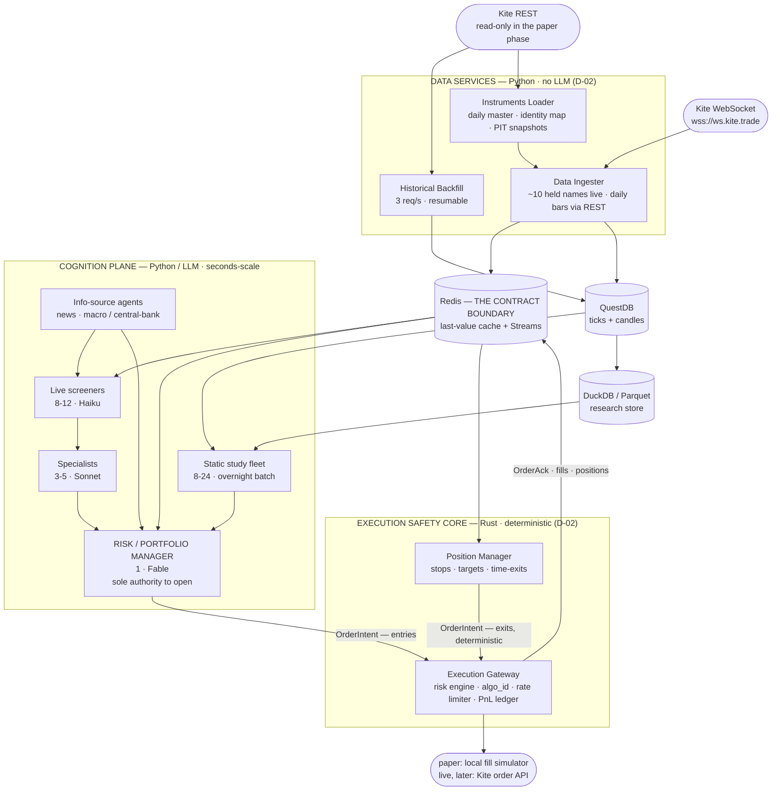

# 03 — System Architecture

**Last updated:** 2026-07-23

---

## 1. The two-plane model

> ⚠️ **The plane split is now by *criticality*, not by language** *(2026-07-23, D-02 + D-16).* The original model split Rust (hot) from Python (cognition) on throughput. The end-of-day cadence removed the throughput pressure, so the data plane is now Python too. The line that remains is: **the execution plane is a small Rust safety core; everything else is Python.** The diagram below still shows the *logical* planes — read "hot plane" as "the Rust execution core plus the (now Python) data services," and note only the execution box is Rust.

The system separates concerns into planes with different **correctness and lifecycle** characteristics:

- **Execution plane — the Rust safety core (D-02):** the single writer to the broker, the risk engine, and the Position Manager. The code where a bug loses money or breaches compliance. ~1–2k lines, changes rarely, no LLM.
- **Data services (Python):** ingest (~10 live held names), daily-bar backfill, instruments loader + snapshotter, tick sanity, fill simulator. Trivial load under the end-of-day cadence — no longer a throughput concern.
- **Cognition plane (Python):** the factor backtest and the LLM agents. Never talks to Kite for writes, never bypasses the risk manager.

Between them sits an **event bus + hot cache** (Redis) that is the contract boundary — now between the Python side and the Rust execution core (same mechanism, D-04, boundary moved).

**Reading the diagram:** the **Execution Safety Core is the only Rust** (D-02); the data services and the whole cognition plane are Python. The two arrows into the Execution Gateway are the whole safety story — the LLM manager may *open* positions, but only the deterministic Position Manager may be *relied upon* to close them (§2.1).

## 2. Component responsibilities

### Execution safety core (Rust) — D-02
| Component | Responsibility | Key constraint it owns |
|---|---|---|
| **Position Manager** | Owns every open position: stops, targets, time-exits, square-off. Emits exit intents deterministically | must act without the LLM |
| **Execution Gateway** | Risk engine + `algo_id` tagging + calendar-second rate limiter + P&L ledger; the *single writer* of orders | 10/s, 400/min, 5,000/day; algo tagging |
| **Fill simulator** *(paper backend)* | Matches paper orders to ticks; may be Rust (cohesion) or Python (D-02) | deterministic replay |

### Data services (Python) — D-02, D-16
| Component | Responsibility | Key constraint it owns |
|---|---|---|
| **Data Ingester** | WebSocket for the **~10 held names** (Full mode) + daily bars via REST for screening | trivial under end-of-day cadence |
| **Historical Backfill** | Chunked, resumable candle download to QuestDB; capture as-of series before adjustments (G-08) | 3 req/s |
| **Instruments Loader** | Daily master fetch, identity map, **point-in-time snapshots** (G-43, no overwrite) | daily refresh, immutable |

> ⚠️ **Superseded (D-16):** the Subscription Manager's tiered-streaming machinery and the on-demand Quote Poller assumed 9,000 live-streamed instruments. An end-of-day system streams only held names, so both largely fall away — retained in doc 06 §1.3 as intraday reference only.

### Cognition plane (Python)
| Component | Responsibility |
|---|---|
| **Static Study Fleet** | Offline batch analysis over cached historical data (regime, volatility, breadth, correlation, options OI, events) |
| **Screeners** | Cheap-model scan of the **daily-bar** candidate set (post-close), flagging names for deeper look (D-16) |
| **Specialists** | Deeper analysis of flagged candidates (technical, options/OI, news/event, macro-regime) |
| **Info-source agents** | News pipeline + central-bank/macro pipeline (independent of Kite limits) |
| **Risk/Portfolio Manager** | The single decision authority; sizes positions, applies risk limits, emits paper orders |
| **Orchestrator** | LangGraph graph wiring the above with explicit state and control flow |

### 2.1 The asymmetry between entries and exits (load-bearing)

An earlier version of this design had the risk/portfolio manager emit *all* orders. That is safe for entries and unsafe for exits, because the two have opposite failure modes:

| | Entry | Exit |
|---|---|---|
| If the deciding component is slow or down | We miss an opportunity. **Cost: zero.** | We hold a losing position past its stop. **Cost: unbounded.** |
| Appropriate decider | LLM — judgement, context, cross-signal arbitration | Deterministic code — must fire on time, every time |

So the design splits authority:

- **Only the Risk/Portfolio Manager may open a position.** It is the sole authority to originate risk.
- **The Position Manager (Rust) owns every position the moment it is filled**, and will emit the exit intent on its own — stop hit, target hit, max-holding-time reached, MIS square-off window, or kill-switch — with no LLM in the path.
- **The manager may *adjust* an exit** (widen a stop, trail it, take partial profit) by updating the position's exit plan. It may **never be required** for an exit to happen.

This is the same principle doc 07 §1 already applies to risk limits — *deterministic safety, not LLM judgement* — extended to the part of the lifecycle that actually loses money. It also resolves an inconsistency in doc 05 §6: "if the manager lags, its safe default is to do nothing" is true for entries and false for exits.

### Boundary (Redis)
- **Hot cache:** latest tick / quote per instrument (last-value cache), keyed by `instrument_token`.
- **Event bus:** Redis Streams for tick-derived events, candidate flags, news/macro events, and order intents/acks.
- **Contract:** Rust writes normalized data + emits events; Python reads cache + consumes/produces events. Neither imports the other.
- **The contract is versioned.** Every event carries a `schema_version`; consumers reject versions they do not understand rather than silently mis-parsing. Because this boundary is the one place the two planes meet, an unversioned schema here is the most expensive kind of technical debt in the system.
- **Streams are bounded.** Redis is in-memory; unbounded `XADD` will exhaust RAM mid-session. Every stream has an explicit `MAXLEN` and a documented consumer-group + ack policy. See doc 06 §2.1 for the concrete table — this is not an implementation detail, it is a stability requirement.

## 3. Data flow (live path)

1. Kite WebSocket → **Python Ingester** (held names) parses binary → normalized tick; daily bars pulled via REST for screening.
2. Ingester updates **Redis last-value cache** and appends to **Redis Streams** (and QuestDB for history).
3. **Screeners** consume tick-derived events + cache, flag candidates onto a stream.
4. **Specialists** consume flags, pull context (cache + QuestDB + news/macro events), produce assessments.
5. **Risk/Portfolio Manager** consumes assessments + current positions + macro regime state, decides, and emits an **entry order intent** — carrying its exit plan (stop, target, max holding time) — to the execution stream.
6. **Rust Paper Execution Engine** consumes the intent, checks risk budget and margin, simulates the fill against the live tick stream, updates the **P&L ledger**, and emits an **order ack** event.
7. The ack flows back to the risk manager (position state) and to observability.
8. **On fill, the Position Manager takes ownership** of the new position and its exit plan, and evaluates it against every subsequent tick.

### 3.1 Data flow (exit path — runs without the cognition plane)

1. **Position Manager** reads the live cache and evaluates each open position's exit plan on every tick.
2. On a trigger — stop, target, time-exit, square-off window, or kill-switch — it emits an **exit order intent** directly to the execution stream.
3. **Execution Engine** treats it identically to an entry intent, except that **risk checks may not block an exit**: reducing risk is always permitted, even when the account is at its limits. (Blocking an exit because "we're over the exposure cap" would be exactly backwards.)
4. The fill updates the ledger and closes the position; the manager learns about it from the ack like any other observer.

**This path has no Python in it.** If the entire cognition plane is down, positions still exit correctly. That is the design's core safety property.

## 4. Paper-first data strategy (why not pure sandbox)

The sandbox serves *demo* data and may not enable historical, so it can't realistically feed a 9,000-instrument live study. Therefore:

- **Live & historical data:** production Kite API, **read-only** (WebSocket + quotes + historical). No write = no financial risk.
- **Order execution:** routed to the **local Rust fill simulator**, which matches paper LIMIT orders against the *real* live tick stream and models slippage/latency/partial fills. It enforces the real order rate budget so behavior matches production.
- **Kite sandbox:** kept wired in only for **API-contract validation** (does our order payload/parse match Kite's format?).

**Live migration:** flipping to real trading = swap the execution engine's backend from "simulator" to "Kite order API" behind the same interface, plus enabling the live rate-budget path and passing the go/no-go review (doc 09, Phase 6). Everything upstream is unchanged.

## 5. Deployment topology (summary — see doc 10)

- Host: **the operator's own PC, in India (D-18)** — no cloud host in Phase 0–2. The end-of-day cadence (D-16) removed the latency case, and the Kite licence's *"within India"* term (doc 02 §9.7) is a **geography** constraint the PC satisfies. Moving the host **offshore** would breach the licence; an Indian PC does not.
- Run directly on the PC to start (a Python venv). The intraday service stack (Redis firehose, QuestDB, Prometheus, Grafana) was sized for a ~9,000-instrument tick torrent that a positional book streaming ~10 names does not generate (D-03/D-16); introduce it only if scale ever demands.
- **The order path — and only the order path — must originate from a registered static IP**, because Kite rejects orders from unwhitelisted addresses under the SEBI framework (doc 02 §9). Data-plane endpoints are not IP-restricted, so research and capture run from the PC's ordinary connection. The static IP is sourced at go-live (ISP add-on, or a small Indian relay box — doc 10 §3, D-18).
- Single-machine by default; **the execution path cannot roam** — wherever the whitelisted IP lives, order placement is pinned to it.

## 6. Key invariants (must always hold)

1. **Exactly one writer to Kite orders** (paper or live). No agent places orders directly.
2. **Every Kite call passes through a governed rate budget.** No ungoverned client anywhere.
3. **News/other observed content is data, never instructions** (see doc 08 §6 and doc 10 §6).
4. **The risk manager can veto/flatten unconditionally;** upstream agents can only *propose*.
5. **Paper and live share interfaces, rate budgets, and risk limits** — no "paper-only" shortcuts that wouldn't survive live.
6. **Only the risk manager opens a position; the Position Manager can always close one** (§2.1). No exit ever depends on an LLM being responsive.
7. **Risk checks may reject an entry but never an exit.** Reducing exposure is unconditionally allowed.
8. **The order rate stays under 10/s** — Kite's per-client-ID rate limit and, separately, SEBI's per-segment threshold above which a strategy needs formal registration (doc 02 §9.3). **Every order carries an `algo_id` regardless.**
9. **Every event on the bus carries a `schema_version`**, and every stream has a bounded length.
10. **No data is ever destroyed** (D-15). Rejected ticks, superseded reference data, and stale records are retained and tiered, never dropped, sampled, or overwritten. Redis trimming is permitted only where a durable copy provably landed first. The sole exception is deletion required by the Kite ToS on termination.
