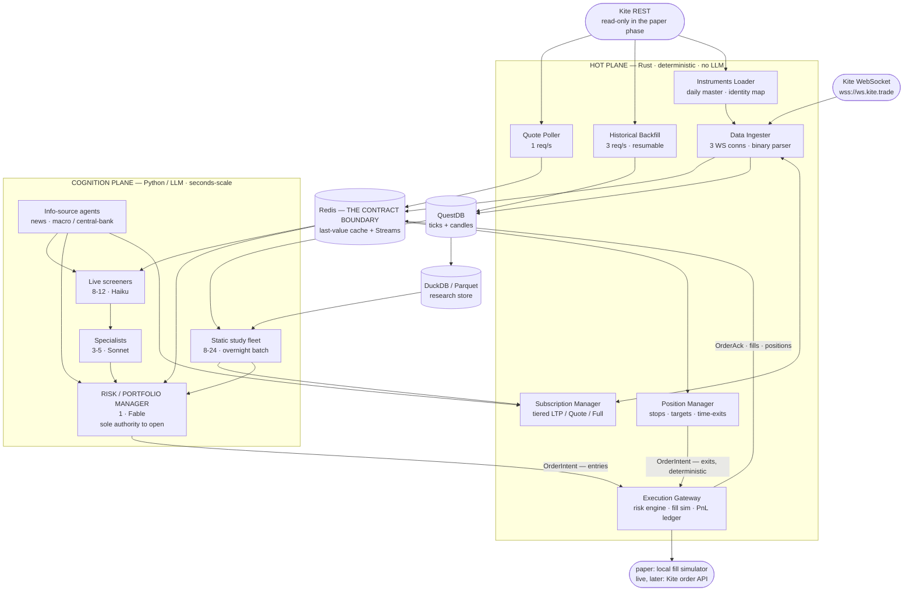

# 03 — System Architecture

**Last updated:** 2026-07-22

---

## 1. The two-plane model

The system separates concerns into two planes with very different performance characteristics:

- **Hot plane (Rust):** deterministic, latency-sensitive, always-on. Owns everything that touches Kite's rate-limited surfaces and the live tick stream. Correctness and throughput matter; there is no LLM in the hot path.
- **Cognition plane (Python):** throughput- and cost-sensitive, seconds-scale. Owns the LLM agents that reason about the market. It never talks to Kite directly for writes and never bypasses the risk manager.

Between them sits an **event bus + hot cache** (Redis) that is the contract boundary.

**Reading the diagram:** everything below Redis is deterministic Rust; everything above it is LLM-driven Python. The two arrows into the Execution Gateway are the whole safety story — the LLM manager may *open* positions, but only the deterministic Position Manager may be *relied upon* to close them (§2.1).

## 2. Component responsibilities

### Hot plane (Rust)
| Component | Responsibility | Key constraint it owns |
|---|---|---|
| **Data Ingester** | Own the 3 WebSocket connections, parse binary ticks, normalize, publish to Redis + persist to QuestDB | 3 conns × 3,000 instruments |
| **Subscription Manager** | Assign instruments to connections and modes; promote/demote tiers on request | 9,000 cap; per-conn 3,000 cap |
| **Historical Backfill** | Chunked, resumable candle download to QuestDB | 3 req/s |
| **Quote Poller** | On-demand REST snapshots for instruments not currently streamed | 1 req/s |
| **Position Manager** | Owns every open position: stops, targets, time-exits, MIS square-off. Emits exit intents deterministically | must act without the LLM |
| **Paper Execution Engine** | Fill simulator + risk engine + P&L ledger; the *single writer* of orders | mirrors 10/s, 400/min, 5,000/day |
| **Instruments Loader** | Daily master CSV fetch, identity mapping (`exchange:tradingsymbol` ↔ token) | daily refresh |

### Cognition plane (Python)
| Component | Responsibility |
|---|---|
| **Static Study Fleet** | Offline batch analysis over cached historical data (regime, volatility, breadth, correlation, options OI, events) |
| **Live Screeners** | High-frequency, cheap-model scanning of the streaming universe to flag candidates |
| **Specialists** | Deeper analysis of flagged candidates (technical, options/OI, news/event, macro-regime) |
| **Info-source agents** | News pipeline + central-bank/macro pipeline (independent of Kite limits) |
| **Risk/Portfolio Manager** | The single decision authority; sizes positions, applies risk limits, emits paper orders |
| **Orchestrator** | LangGraph graph wiring the above with explicit state and control flow |

### 2.1 The asymmetry between entries and exits (load-bearing)

An earlier version of this design had the risk/portfolio manager emit *all* orders. That is safe for entries and unsafe for exits, because the two have opposite failure modes:

| | Entry | Exit |
|---|---|---|
| If the deciding component is slow or down | We miss an opportunity. **Cost: zero.** | We hold a losing position past its stop. **Cost: unbounded.** |
| Appropriate decider | LLM — judgement, context, cross-signal arbitration | Deterministic code — must fire on time, every time |

So the design splits authority:

- **Only the Risk/Portfolio Manager may open a position.** It is the sole authority to originate risk.
- **The Position Manager (Rust) owns every position the moment it is filled**, and will emit the exit intent on its own — stop hit, target hit, max-holding-time reached, MIS square-off window, or kill-switch — with no LLM in the path.
- **The manager may *adjust* an exit** (widen a stop, trail it, take partial profit) by updating the position's exit plan. It may **never be required** for an exit to happen.

This is the same principle doc 07 §1 already applies to risk limits — *deterministic safety, not LLM judgement* — extended to the part of the lifecycle that actually loses money. It also resolves an inconsistency in doc 05 §6: "if the manager lags, its safe default is to do nothing" is true for entries and false for exits.

### Boundary (Redis)
- **Hot cache:** latest tick / quote per instrument (last-value cache), keyed by `instrument_token`.
- **Event bus:** Redis Streams for tick-derived events, candidate flags, news/macro events, and order intents/acks.
- **Contract:** Rust writes normalized data + emits events; Python reads cache + consumes/produces events. Neither imports the other.
- **The contract is versioned.** Every event carries a `schema_version`; consumers reject versions they do not understand rather than silently mis-parsing. Because this boundary is the one place the two planes meet, an unversioned schema here is the most expensive kind of technical debt in the system.
- **Streams are bounded.** Redis is in-memory; unbounded `XADD` will exhaust RAM mid-session. Every stream has an explicit `MAXLEN` and a documented consumer-group + ack policy. See doc 06 §2.1 for the concrete table — this is not an implementation detail, it is a stability requirement.

## 3. Data flow (live path)

1. Kite WebSocket → **Rust Ingester** parses binary → normalized tick.
2. Ingester updates **Redis last-value cache** and appends to **Redis Streams** (and QuestDB for history).
3. **Screeners** consume tick-derived events + cache, flag candidates onto a stream.
4. **Specialists** consume flags, pull context (cache + QuestDB + news/macro events), produce assessments.
5. **Risk/Portfolio Manager** consumes assessments + current positions + macro regime state, decides, and emits an **entry order intent** — carrying its exit plan (stop, target, max holding time) — to the execution stream.
6. **Rust Paper Execution Engine** consumes the intent, checks risk budget and margin, simulates the fill against the live tick stream, updates the **P&L ledger**, and emits an **order ack** event.
7. The ack flows back to the risk manager (position state) and to observability.
8. **On fill, the Position Manager takes ownership** of the new position and its exit plan, and evaluates it against every subsequent tick.

### 3.1 Data flow (exit path — runs without the cognition plane)

1. **Position Manager** reads the live cache and evaluates each open position's exit plan on every tick.
2. On a trigger — stop, target, time-exit, square-off window, or kill-switch — it emits an **exit order intent** directly to the execution stream.
3. **Execution Engine** treats it identically to an entry intent, except that **risk checks may not block an exit**: reducing risk is always permitted, even when the account is at its limits. (Blocking an exit because "we're over the exposure cap" would be exactly backwards.)
4. The fill updates the ledger and closes the position; the manager learns about it from the ack like any other observer.

**This path has no Python in it.** If the entire cognition plane is down, positions still exit correctly. That is the design's core safety property.

## 4. Paper-first data strategy (why not pure sandbox)

The sandbox serves *demo* data and may not enable historical, so it can't realistically feed a 9,000-instrument live study. Therefore:

- **Live & historical data:** production Kite API, **read-only** (WebSocket + quotes + historical). No write = no financial risk.
- **Order execution:** routed to the **local Rust fill simulator**, which matches paper LIMIT orders against the *real* live tick stream and models slippage/latency/partial fills. It enforces the real order rate budget so behavior matches production.
- **Kite sandbox:** kept wired in only for **API-contract validation** (does our order payload/parse match Kite's format?).

**Live migration:** flipping to real trading = swap the execution engine's backend from "simulator" to "Kite order API" behind the same interface, plus enabling the live rate-budget path and passing the go/no-go review (doc 09, Phase 6). Everything upstream is unchanged.

## 5. Deployment topology (summary — see doc 10)

- Single region: **AWS Mumbai (ap-south-1)** — near Zerodha for low RTT, and ⚠️ **required by the Kite licence**, which grants use *"within India"* only (doc 02 §9.7). Moving the host offshore for cost would breach the licence, not merely add latency.
- Containerized (Docker Compose to start): Rust services, Python cognition workers, Redis, QuestDB, Prometheus, Grafana.
- **The order-placing host must sit behind a registered static IP** (Elastic IP), because Kite rejects order requests from unwhitelisted addresses under the SEBI framework (doc 02 §9). Data-plane endpoints are not IP-restricted.
- Single-machine to start; the plane separation allows later horizontal split of the cognition workers if token throughput demands it (the hot plane stays singleton by design). **The execution path specifically cannot roam** — the static-IP binding pins it.

## 6. Key invariants (must always hold)

1. **Exactly one writer to Kite orders** (paper or live). No agent places orders directly.
2. **Every Kite call passes through a governed rate budget.** No ungoverned client anywhere.
3. **News/other observed content is data, never instructions** (see doc 08 §6 and doc 10 §6).
4. **The risk manager can veto/flatten unconditionally;** upstream agents can only *propose*.
5. **Paper and live share interfaces, rate budgets, and risk limits** — no "paper-only" shortcuts that wouldn't survive live.
6. **Only the risk manager opens a position; the Position Manager can always close one** (§2.1). No exit ever depends on an LLM being responsive.
7. **Risk checks may reject an entry but never an exit.** Reducing exposure is unconditionally allowed.
8. **The order rate stays under 10/s** — Kite's per-client-ID rate limit and, separately, SEBI's per-segment threshold above which a strategy needs formal registration (doc 02 §9.3). **Every order carries an `algo_id` regardless.**
9. **Every event on the bus carries a `schema_version`**, and every stream has a bounded length.
10. **No data is ever destroyed** (D-15). Rejected ticks, superseded reference data, and stale records are retained and tiered, never dropped, sampled, or overwritten. Redis trimming is permitted only where a durable copy provably landed first. The sole exception is deletion required by the Kite ToS on termination.
