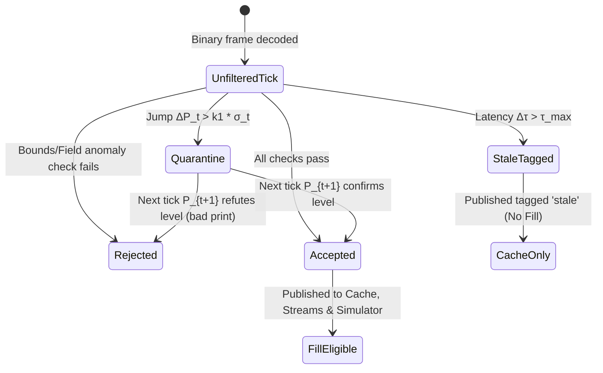

# 06 — Data Plane Spec (Rust)

**Last updated:** 2026-07-22

The data plane owns everything that reads from Kite's market-data surfaces and turns it into normalized, queryable state. No LLM here.

---

## 1. Components

### 1.1 Instruments Loader
- Fetch the daily gzipped instruments CSV (~08:30 AM) from `/instruments`.
- Parse into an in-memory + persisted map.
- Maintain **two indexes:** `exchange:tradingsymbol` (stable identity) and `instrument_token` (WS subscription).
- Detect expiries/rollovers so a reused `instrument_token` is never mis-attributed.
- Publish "instruments ready" so downstream services can start.

### 1.2 Data Ingester (WebSocket)
- Open **up to 3** connections to `wss://ws.kite.trade`.
- Subscribe up to **3,000 instruments per connection** (9,000 total).
- Parse the binary frame: 2-byte packet count → repeating [2-byte length][packet]; decode by mode (LTP 8B / Quote 44B / Full 184B; index packets 28B/32B).
- Normalize into a canonical `Tick` struct (see §3).
- Fan out: update Redis last-value cache + append to Redis Streams + persist to QuestDB.
- Handle heartbeats; detect stale connections; auto-reconnect with resubscription.

### 1.3 Subscription Manager (tiered modes)
This is the key mechanism for fitting 9,000 instruments into a sane bandwidth/CPU budget.

- **Tiers:**
  - **Full** (184B, 5-level depth) — the active/traded subset (target: a few hundred).
  - **Quote** (44B) — the broad watch.
  - **LTP** (8B) — the long tail.
- **Promotion/demotion:** driven by requests from the cognition plane (e.g., the static study fleet's morning promotion list, or a news catalyst flag) and by intraday activity heuristics (volume/volatility spikes).
- **Placement:** assign instruments across the 3 connections to balance load; keep per-connection ≤ 3,000.
- **Live mode changes** via the `mode` subscription action — no reconnect needed.

#### Promotion / demotion policy (G-06 — specified 2026-07-22)

**What the cap is set by.** ⚠️ *Corrected:* the Full-tier size is **not** bandwidth-limited — even all 9,000 in Full mode is ~13 Mbps (§6, doc 02 §3). The real constraints are **parse CPU** (10 depth entries per packet per tick), **storage** (depth is the bulk of the volume and the least reusable), and **downstream usefulness** (depth on an instrument nobody trades is pure overhead). Tune the cap against those, not against network fear.

**Tier budgets (draft):**

| Tier | Target count | Who gets it |
|---|---|---|
| **Full** | ~300, hard cap 500 | Open positions, the day's promotion list, live news catalysts, intraday movers |
| **Quote** | ~3,000 | The broad watchlist |
| **LTP** | remainder | Long tail |

**Priority ordering — the Full tier is allocated, not first-come.** When demand exceeds the cap, admit in this order and evict from the bottom:

| Priority | Source | Rationale |
|---|---|---|
| **1** | **Instruments with open positions** | Never demotable. The Position Manager evaluates stops against these — depth here is a safety requirement, not an optimization |
| **2** | Pending order / active candidate at the manager | About to become a position |
| **3** | News catalyst flag (doc 08 §4) | Time-sensitive and short-lived |
| **4** | Morning promotion list (study fleet) | Known at 09:00; fills the baseline |
| **5** | Intraday activity heuristic | Opportunistic; first to be evicted |

**Priority 1 is a hard invariant, not a preference.** An open position losing Full-mode depth means stop evaluation degrades to last-price — reconcile against doc 07 §4 before ever relaxing it.

**Hysteresis — the anti-flapping rules.** Mode changes are cheap individually and ruinous in aggregate (each is a subscription message, and a flapping instrument churns parse state and cache):

- **Asymmetric thresholds.** Promote at activity > *P*; demote only below *0.5 × P*. A single band guarantees oscillation around it.
- **Minimum dwell time.** Once promoted, hold Full for at least *T_min* (start at 5 minutes) regardless of activity. Prevents a one-tick spike from buying a mode change.
- **Demotion grace.** Require the demote condition to hold continuously for *T_cool* (start at 10 minutes) before acting.
- **Global rate limit.** Cap total mode changes per minute across all connections. On breach, apply only the highest-priority pending changes and log the deferred ones — never silently drop.
- **Priority 1 and 2 bypass all of the above** in the promote direction: a new position gets depth immediately.

**Arbitration.** A single Subscription Manager owns the Full-tier allocation and is the only writer of mode changes. Promotion *requests* from the study fleet, news pipeline, and intraday heuristic are advisory — they enter a priority queue, and the manager admits against the cap. This is the same single-writer discipline the execution path uses, for the same reason: concurrent writers to a capped resource race.

⚠️ **All values above are asserted starting points.** Tune against replayed sessions (doc 07 §4.3), measuring: mode changes per minute, time-to-promote after a catalyst, and how often the cap actually binds. If it never binds, the cap is too generous and CPU is being wasted; if it binds constantly, the priority ordering is doing real work and deserves scrutiny.

**Metrics:** promotions/demotions per minute by priority source; Full-tier occupancy vs. cap; deferred promotions; count of open positions **not** in Full mode (**must be zero** — alert immediately).

### 1.4 Quote Poller (REST)
- For instruments **not currently streamed**, or to reconcile/verify, poll `/quote`, `/quote/ohlc`, `/quote/ltp`.
- Governed by a **1 req/s** token bucket; batch up to 500/1000/1000 symbols per call respectively.
- Used sparingly — streaming is the primary path.

### 1.5 Historical Backfill
- Chunked, **resumable** candle download to QuestDB, respecting per-request day caps (doc 02 §5) and a **3 req/s** token bucket.
- Supports `continuous=1` and `oi=1` where relevant.
- Runs as a batch job *before* the static study fleet needs the data.
- Tracks a per-(instrument, interval) high-water mark so restarts resume, not restart.

---

### 1.6 Tick sanity filter (gate before anything downstream)

**Why this exists:** the fill simulator (doc 07 §4) matches paper orders against the live tick stream. A single erroneous print therefore produces a phantom fill and a corrupted ledger — and unlike a dropped tick, a *wrong* tick fails silently. §4 covers ticks we didn't get; this covers ticks we shouldn't trust.

Every decoded tick passes a cheap, deterministic gate before it reaches the cache, the streams, or the simulator:

| Check | Rule & Mathematical Specification | On failure |
|---|---|---|
| **Circuit bounds** | $P_{\text{circuit, low}} \le P_t \le P_{\text{circuit, high}}$ (sourced from daily `/quote` limit band) | Reject, increment metric `kestrel_tick_sanity_reject_total{reason="circuit"}` |
| **Jump filter** | $\Delta P_t = \|P_t - P_{\text{last\_accepted}}\| > k_1 \cdot \max(\sigma_t, \theta_{\text{floor}})$, where $\sigma_t^2 = (1-\lambda) (\Delta P_{t-1})^2 + \lambda \sigma_{t-1}^2$ ($\lambda = 0.94$, $k_1 = 4.0$) | **Quarantine state machine**: Hold tick $P_t$. If $\|P_{t+1} - P_t\| \le k_2 \sigma_t$, promote $P_t$ & $P_{t+1}$ to `Accepted`; else reject $P_t$ as phantom print |
| **Staleness** | $\Delta \tau = t_{\text{recv}} - t_{\text{exchange}} > \tau_{\max}$ (default $\tau_{\max} = 1500\text{ ms}$) or heartbeat age $> \tau_{\text{heartbeat}}$ | Tag cache entry `stale`; **stale ticks are strictly ineligible for paper order fills** |
| **Monotonic volume** | $\Delta V_t = V_t - V_{t-1} \ge 0$ within a single continuous market session | Reject; flag potential feed/sequence reset |
| **Sane fields** | $Q_{\text{last}} \ge 0$, $V_t \ge 0$, $P_{\text{bid}, i} \le P_{\text{ask}, i} \, \forall i \in [1, 5]$, $P_t > 0$ | Reject, increment `kestrel_tick_sanity_reject_total{reason="field_anomaly"}` |
| **Post-reconnect** | First ticks following socket reconnect marked `resync` until full depth snapshot receipt | Tag `resync`; **ineligible for fills** until snapshot validation |

#### State Transition Dynamics of the Sanity Gate



#### ⚠️ Session start: warm-up and the overnight gap

The EWMA above is undefined at the first tick of the day, and **naïvely carrying yesterday's $\sigma$ across the overnight break makes the filter wrong in the worst possible way.** A stock that legitimately gaps 5% at the open — on results, a block deal, a rating change — will breach $k_1 \sigma_t$ computed from yesterday's *intraday* volatility and be quarantined or rejected. The open is simultaneously when genuine gaps happen and when bad prints cluster, so this is the case the filter most needs to get right.

**Rules:**

1. **Seed, don't inherit.** At session start, initialize from the overnight-gap-aware daily range rather than yesterday's tick-to-tick variance:
   $$\sigma_{t_0} = \max\left(\sigma_{\text{daily hist}} \cdot \kappa_{\text{open}}, \; \theta_{\text{floor}}\right)$$
   with $\kappa_{\text{open}} > 1$ (start at 3.0) widening the band through the opening window. Tighten $\kappa_{\text{open}}$ back to 1.0 over the first ~15 minutes as live ticks accumulate.
2. **Reference the pre-open equilibrium price**, not yesterday's close, once the pre-open call auction has produced one. That price *is* the market's own estimate of the gap, which makes it the correct baseline for judging whether an opening tick is plausible.
3. **Warm-up period.** Until $N_{\text{warm}}$ (start at 30) accepted ticks exist for an instrument, the jump filter runs in **observe-only** mode: it tags and counts but does not reject. Circuit bounds, field sanity, and monotonic volume stay fully active throughout — they need no history.
4. **Instruments that never warm up** (illiquid names with a handful of ticks a day) stay permanently in observe-only for the jump filter. **A filter with no statistical basis must not be given veto power** over its own input; circuit bounds are the real protection there.
5. **Reset $\sigma$ at every session boundary** — pre-open, normal, closing auction, and special sessions each have distinct tick dynamics (G-17). Carrying state across a boundary imports the wrong distribution.

⚠️ $\kappa_{\text{open}}$, $N_{\text{warm}}$, and $\theta_{\text{floor}}$ are asserted starting values. Fit them against replayed opening sessions, including known gap days, before trusting the filter at the open.

**Design rules:**
- **Every rejected tick is persisted in full** with its reject reason and the state that triggered it — not sampled, not counted-and-discarded (D-15). Reject rate is also surfaced as a metric, since a rising rate is a feed-health signal.
  - *Why keep them all:* today's "obvious bad print" is tomorrow's evidence that the filter is mis-tuned. The reject set is the only record of what the system chose **not** to act on, and it is the first thing you need when a fill looks wrong. It is also small — rejects are by construction a tiny fraction of ~9,000 events/sec.
- **The filter is fail-closed for execution, fail-open for observation.** A suspicious tick still reaches the cache tagged `suspect` (so screeners see the market moving) but cannot trigger a simulated fill.
- **The thresholds are data, not code** — they live in config so they can be tuned from replay without a rebuild.
- **Observe-only mode is the default for anything unproven.** Any new or unfitted check ships tagging-but-not-rejecting until replay shows its reject set is genuinely bad prints.

⚠️ Deliberately conservative to start. Over-rejecting costs us fills in the simulator; under-rejecting corrupts the paper P&L that the entire go/no-go decision rests on. **At the open, over-rejecting is the greater risk** — a rejected genuine gap blinds every downstream agent to the day's most informative move.

---

## 2. Rate-budget governance (shared, per-key)

All REST callers (quote poller, backfill, and later the live order path) draw from **centralized token buckets** that mirror Kite's per-key limits:
- Quote bucket: 1/s
- Historical bucket: 3/s
- Order bucket: 10/s, 400/min, 5,000/day

No component may call Kite except through these buckets. A single process owns each bucket; if the system is ever split across hosts, the buckets must become a shared/distributed limiter (flagged: doc 11, Gap G-07).

**Note:** the order bucket's 10/s ceiling coincides with SEBI's threshold for **formal strategy registration** (doc 02 §9.3). Breaching it is a compliance event, not just a `429`. ⚠️ The two limits are scoped differently — Kite per client ID, SEBI per exchange segment — so one bucket may not satisfy both.

---

## 2.1 Redis stream contract (bounded, versioned, acked)

Redis is in-memory and is the contract boundary between the two planes. Both facts have consequences that must be specified, not left to implementation:

**Every stream is bounded.** Unbounded `XADD` at 9,000-instrument tick volume exhausts RAM within a session. Every stream declares a cap, applied with `XADD ... MAXLEN ~ N` (the `~` allows efficient approximate trimming):

| Stream | Purpose | Cap (draft) | Retention rationale |
|---|---|---|---|
| `kestrel:ticks` | Tick-derived events for screeners | **~500k entries** (~1 min at 9k events/s) | Consumers are live; history lives in QuestDB |
| `kestrel:candidates` | Screener → specialist flags | ~10k entries | Short-lived working set |
| `kestrel:assessments` | Specialist → manager | ~10k entries | Short-lived working set |
| `kestrel:orders` | Intents and acks | ~50k entries | **Also persisted to the ledger** — Redis is transport, not the record |
| `kestrel:news` / `kestrel:macro` | Info-source events | ~1 day | Low volume; a day of context is useful |

**Rule:** *no stream is the system of record.* Anything that must survive is written to QuestDB or the ledger **before** the `XADD`, not alongside it. Trimming must never be able to lose data we needed.

⚠️ **Under D-15 this ordering is enforced, not assumed.** Trimming is the one place the design deliberately discards bytes, so it is permitted **only** where the durable write provably completed first. Concretely: the ingester acknowledges the QuestDB write before publishing to the stream, and **a trim event while any consumer group is lagging raises an alert** — that combination is the signature of actual data loss rather than routine trimming.

**Sizing the caps.** From §6: ~9,000 events/sec at target volume. At ~200 bytes per tick-derived event, a 500k-entry `kestrel:ticks` cap is **~100 MB and ~1 minute of history** — enough for a consumer to survive a GC pause or a brief restart, not enough to mask a real outage. Total across all streams should sit well under half of host RAM, leaving headroom for the last-value cache (9,000 instruments × ~1 KB ≈ 9 MB, trivial) and Redis's own overhead.

⚠️ **Derive the caps from measured event rate in Phase 1, then set them explicitly.** The failure mode to avoid is discovering the right cap during a session — by then Redis has already OOMed, taking the contract boundary with it.

**Consumer groups and acks.** Each logical consumer reads via `XREADGROUP` with an explicit group name, so that:
- restarts resume from the pending-entries list rather than skipping or replaying everything;
- a crashed consumer's un-acked entries are visible and reclaimable (`XAUTOCLAIM`);
- lag per group is a first-class metric (below).

**Dead-letter path.** An entry that fails processing three times moves to `kestrel:dlq` with its error and original payload, and raises an alert. It never blocks the group.

**Schema versioning.** Every event carries `schema_version`. Consumers **reject** unknown major versions loudly rather than parsing best-effort — a silent mis-parse across the plane boundary is the worst available failure. Schemas are defined once and shared, generated for both Rust and Python from a single source so they cannot drift.

**Backpressure.** If a group's lag exceeds its threshold, the producer throttles (doc 05 §6) — it does not simply outrun the consumer and rely on trimming to hide it. Silent trimming under lag would look exactly like a healthy system.

---

## 3. Canonical data model (draft)

```
Tick {
  instrument_token: u32,
  exchange_ts: i64,        // exchange timestamp (ms)
  recv_ts: i64,            // our receive timestamp (ms) — for latency measurement
  last_price: f64,
  last_qty: u32,
  avg_price: f64,
  volume: u64,
  buy_qty: u64,
  sell_qty: u64,
  ohlc: { open, high, low, close },
  oi: u64,                 // where applicable
  depth: Option<[DepthLevel; 5]> x2  // bids/offers, Full mode only
  mode: enum { Ltp, Quote, Full },
}
```
- Persisted to QuestDB (partitioned by day, symbol).
- Last-value cache in Redis keyed by `instrument_token`.
- Candles (from backfill + rolled-up live) stored per interval.

**Open:** corporate-action adjustment for historical candles (splits/bonus) — Kite's handling must be verified and, if needed, an adjustment layer added (doc 11, Gap G-08).

---

## 4. Reliability requirements

| Concern | Requirement |
|---|---|
| Reconnection | Auto-reconnect each WS connection with full resubscription and mode restoration; bounded backoff |
| Gap detection | Detect missed sequence/heartbeat; log gaps; backfill affected windows |
| No silent drops | Every dropped/late tick is counted and surfaced to metrics |
| Token expiry (403) | On `TokenException`, pause cleanly and resume when a fresh `access_token` is supplied |
| Crash recovery | On restart, reload instruments, resume backfill from high-water marks, re-establish streams |
| Clock discipline | NTP-synced host; record both exchange and receive timestamps; alert on skew |
| Backpressure | If QuestDB/Redis writes lag, prefer cache freshness over history completeness (history is backfillable) |

---

## 5. Metrics to expose (Prometheus)
- Ticks/sec per connection and total; parse errors/sec.
- **Tick sanity: rejects/sec by reason; quarantine depth; % of cache entries currently `suspect` or `stale`.**
- Per-tier instrument counts; promotions/demotions per minute.
- WS reconnects; heartbeat age per connection.
- Rate-budget headroom (tokens remaining) for each bucket.
- Tick-to-cache and tick-to-QuestDB latency (p50/p99).
- **Redis: stream length vs. cap per stream; consumer-group lag per group; pending-entry count; DLQ depth; trim events/sec** (a trim while a group is lagging means data loss — alert on it).
- Backfill progress (instruments × intervals complete).

---

## 6. Sizing — the back-of-envelope, then the measurement

The previous version of this document left bandwidth and storage entirely open. Both are estimable in five lines, and the estimate changes how seriously to treat them.

**Assumption:** Kite's feed is throttled/aggregated to roughly **one update per instrument per second** (⚠️ verify in Phase 1 — this is the load-bearing number, and bursts around the open will exceed it).

Target mix: 300 Full (184 B) + 3,000 Quote (44 B) + 5,700 LTP (8 B):

| Tier | Count | Bytes | Bytes/sec |
|---|---|---|---|
| Full | 300 | 184 | 55,200 |
| Quote | 3,000 | 44 | 132,000 |
| LTP | 5,700 | 8 | 45,600 |
| **Total** | **9,000** | | **≈ 233 KB/s ≈ 1.9 Mbps** |

Over a 6.25-hour session: **≈ 5.2 GB/day raw**, before framing overhead and before compression.

**What this tells us:**
- **Bandwidth is a non-issue.** ~2 Mbps sustained is nothing for an ap-south-1 host, even with a large burst multiple at the open. This closes the former Gap G-16 to a Phase 1 confirmation rather than an open design question.
- **Storage is a *tiering* decision, not a retention one** (D-15). ~5 GB/day raw is roughly **1.3 TB/year uncompressed**; Parquet+zstd typically cuts that ~8×. At ~160 GB/year compressed, **keeping everything forever costs about $24/year on S3 Standard-IA** — a third of the Kite subscription and 0.3% of the lean LLM line. There is no cost worth deleting data to control. The question is therefore not "how long do we keep full depth" but "which tier does it live in after N days."
- **The real risk is write *rate*, not write *volume*.** 9,000 updates/sec sustained into QuestDB is the thing to measure, and it remains a 🔴 gap (G-03).

**Still to measure in Phase 1 (do not assume):** actual tick cadence and open-bell burst multiple, QuestDB sustained ingest at that rate, on-disk compression ratio, and the resulting retention policy.
