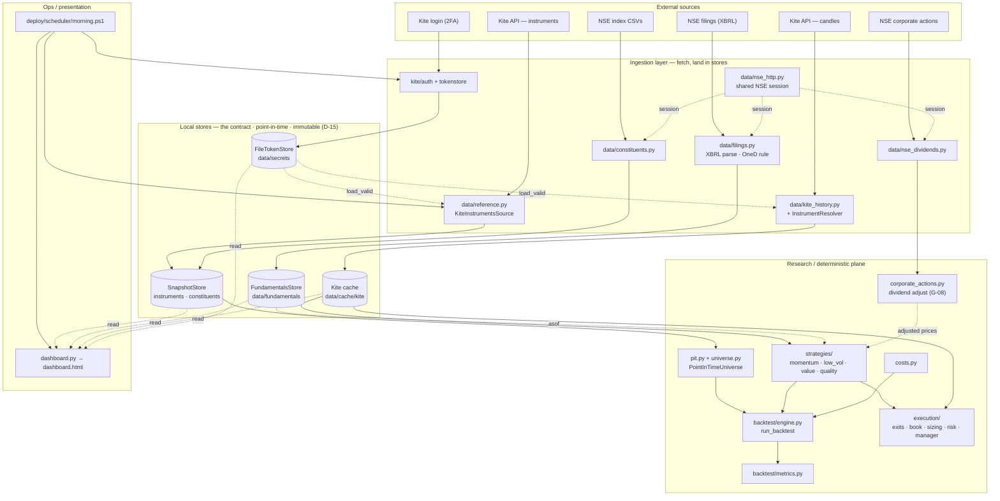

# 14 — As-built architecture

**Last updated:** 2026-07-25

This is what **actually exists in code** today — the deterministic data + research
+ execution spine, all Python, running on the operator's PC (D-18). It complements
[doc 03](03-architecture.md), which describes the *designed* target system (LLM
planes, Rust, Redis/QuestDB). Where the two differ, this document is the reality.

The organising idea: **three layers that never call each other directly.** They
coordinate through shared, point-in-time **stores** (the contract) and a handful
of swappable **protocols** (the seams). Every store answers `asof(date)`, so the
research layer can rewind universe, prices, fundamentals, and dividends to the
same historical instant without ever leaking the future.



## The contract: stores

Ingestion **writes**; research **reads**. They meet on disk, never in code.

| Store | Written by | Read by |
|---|---|---|
| `SnapshotStore` (dated, immutable) | instruments + constituents snapshotters | `pit.py` → universe |
| `FundamentalsStore` (point-in-time JSONL) | `ingest_/harvest_fundamentals` | value + quality factors |
| Kite cache (OHLC) | `pull_history.py` | backtest engine, slice |
| `FileTokenStore` (0600) | `kite_login.py` | Kite history + instruments fetch |

## The seams: protocols

Each source hides behind an interface, so dev and real implementations are
interchangeable and nothing is hard-wired:

| Protocol | Method | Real / dev implementations |
|---|---|---|
| `FundamentalsSource` | `asof()` | `FundamentalsStore` / `StaticFundamentals` |
| `UniverseProvider` | `members_asof()` | `PointInTimeUniverse` / `StaticUniverse` |
| `DividendSource` | `events()` | `NSEDividendSource` / `StaticDividends` |
| `FilingsSource` | `recent()`, `fetch_xbrl()` | `NSEFilingsSource` / `StaticFilings` |
| `ReferenceSource` | `fetch()` | `KiteInstrumentsSource` / `StaticListSource` |
| `TokenStore`, `Sizer` | — | file-backed / pluggable |

## Two end-to-end flows

**Backtest** — four independently-sourced inputs converge on one call:
```
snapshots ─▶ build_index_universe ─▶ PointInTimeUniverse ┐
Kite cache ─▶ prices ─▶ strategy.scores() ───────────────┤─▶ run_backtest(...) ─▶ metrics
FundamentalsStore.asof() ─▶ value/quality scores ────────┘   (costs.py charges turnover)
```

**Live / slice** — deterministic, no LLM, no research-layer dependency in the loss path (D-07):
```
bars ─▶ PositionManager.on_bar() ─▶ evaluate each ExitPlan ─▶ book ledger
```

**Daily ops** — `morning.ps1` runs the one human-in-the-loop step, then everything
downstream reads the stores it just refreshed:
```
kite_login  →  snapshot_reference (--require-live)  →  dashboard refresh
```

## Not built (by design)

- **LLM cognition plane** (screener/specialist agents, the risk-manager entry
  authority) — deferred per D-09/D-16 (prove the deterministic spine first). When
  built, it slots *between* `scores` and the Position Manager as an entry filter
  that must beat the factor; exits stay deterministic regardless (D-07).
- **Redis / QuestDB** — not needed at this scale (end-of-day, ~10 held names).
- **Live order placement** — needs the registered static IP (D-18); the data and
  research planes need neither.
